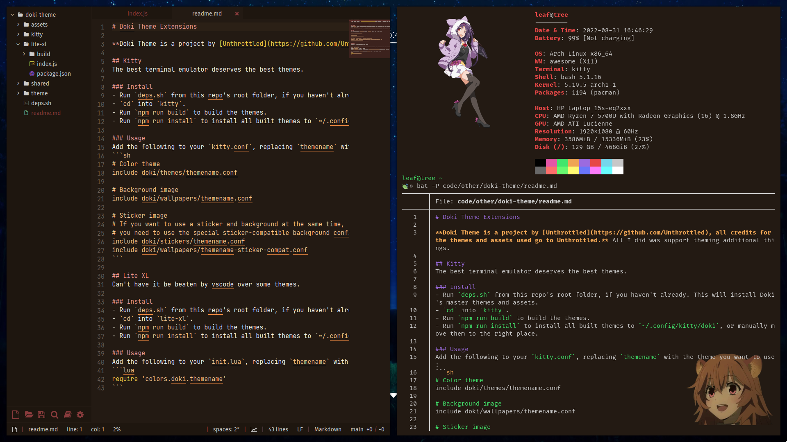
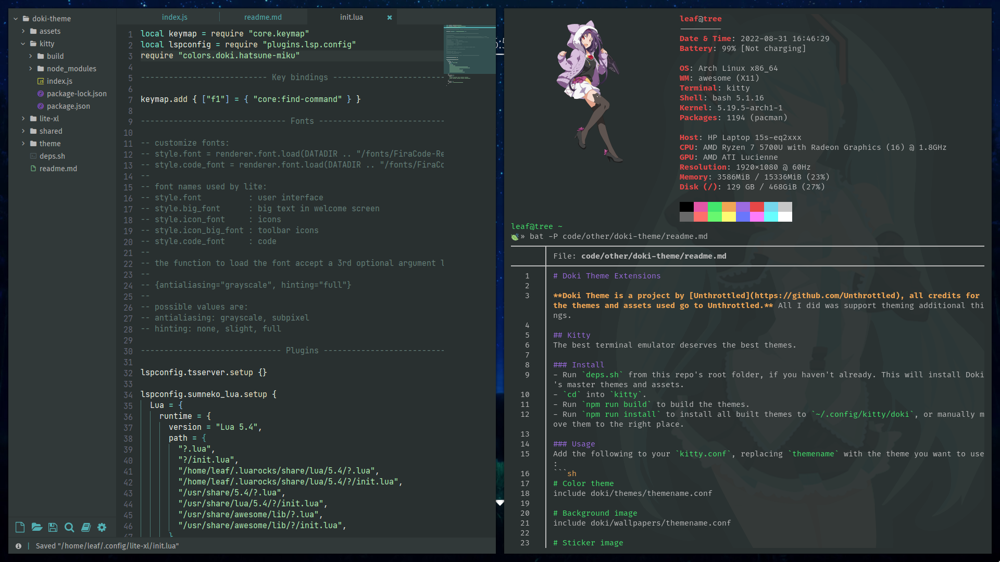
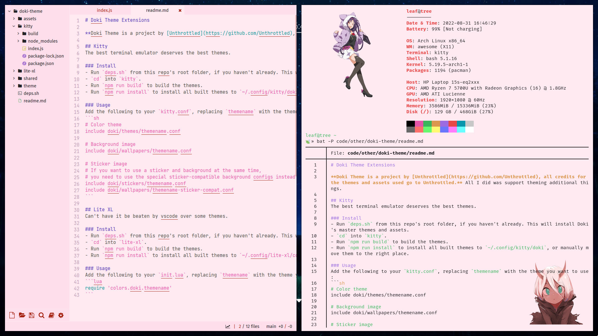

# Doki Theme Extensions

**Doki Theme is a project by [Unthrottled](https://github.com/Unthrottled), all credits for the themes and assets used go to Unthrottled.** All I did was support theming additional things.

## Screenshots

<details>
  <summary>Raphtalia</summary>
  
</details>

<details>
  <summary>Hatsune Miku</summary>
  
</details>

<details>
  <summary>Zero Two</summary>
  
</details>

## Kitty
The best terminal emulator deserves the best themes.

### Install
- Run `deps.sh` from this repo's root folder, if you haven't already. This will install Doki's master themes and assets.
- `cd` into `kitty`.
- Run `npm run build` to build the themes.
- Run `npm run install` to install all built themes to `~/.config/kitty/doki`, or manually move them to the right place.

### Usage
Add the following to your `kitty.conf`, replacing `themename` with the theme you want to use:
```sh
# Color theme
include doki/themes/themename.conf

# Background image
include doki/wallpapers/themename.conf

# Sticker image
# If you want to use a sticker and background at the same time,
# you need to use the special sticker-compatible background configs instead of the normal ones
include doki/stickers/themename.conf
include doki/wallpapers/themename-sticker-compat.conf
```

## Lite XL
Can't have it be beaten by vscode over some themes.

### Install
- Run `deps.sh` from this repo's root folder, if you haven't already. This will install Doki's master themes and assets.
- `cd` into `lite-xl`.
- Run `npm run build` to build the themes.
- Run `npm run install` to install all built themes to `~/.config/lite-xl/colors/doki`, or manually move them to the right place.

### Usage
Add the following to your `init.lua`, replacing `themename` with the theme you want to use:
```lua
require 'colors.doki.themename'
```